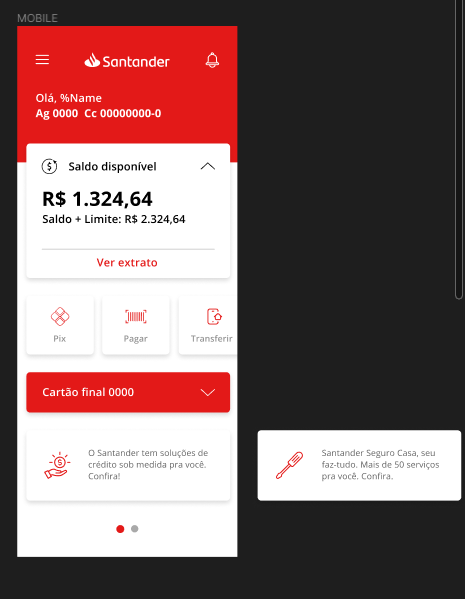

# Banco Santander App Clone - Santander Dev Week 2023



Este é um projeto de clone do aplicativo móvel do Banco Santander desenvolvido como parte de um desafio de aprendizagem em programação durante o pré-aquecimento do Bootcamp Santander Dev Week 2023 com o objetivo de recriar a interface e algumas funcionalidades do aplicativo original.

## Sobre o Projeto

O objetivo deste projeto é recriar a aparência e algumas das funcionalidades do aplicativo móvel do Banco Santander utilizando o SwiftUI para criação da interface do usuário em Swift.

O aplicativo inclui algumas das principais telas e componentes do aplicativo original, como a tela de saldo, detalhes da conta, extrato, transferências, entre outras. O projeto utiliza a biblioteca SwiftUI para criar uma interface moderna e interativa.

## Funcionalidades

- Tela de saldo, exibindo o saldo disponível e o limite da conta.
- Detalhes da conta, exibindo informações como agência, número da conta e outros detalhes.
- Funcionalidade de Transferência PIX, Pagamento de Boletos e Transferência TED.
- Integração com API simulada ou dados fictícios.

## Pré-requisitos

- Mac com MacOS
- XCode 15 ou superior
- Swift Language
- SwiftUI
- Conta de desenvolvedor da Apple

## Como Executar o Projeto

1. Clone o repositório para sua máquina local utilizando o Git:

```js
git clone https://github.com/designtechti490/santander-clone.git
```

2. Abra o projeto no XCode.

3. Aguarde o XCode carregar o projeto e sincronizar as dependências.

4. Conecte um dispositivo iOS ao computador ou utilize um emulador.

5. Execute o aplicativo no dispositivo ou emulador selecionando a opção "Run 'app'" no XCode.

## Tecnologias Utilizadas

 &nbsp;


## Contribuição

Contribuições são bem-vindas! Se você encontrou algum problema no projeto ou deseja adicionar novas funcionalidades, fique à vontade para abrir um Pull Request.

Antes de enviar suas alterações, certifique-se de executar os testes e garantir que o código esteja de acordo com as diretrizes do projeto.

## Licença

Este projeto é licenciado sob a [MIT License](LICENSE.md).

## Aviso Legal

Este projeto é apenas um clone do aplicativo do Banco Santander desenvolvido por razões educacionais e de aprendizado. Não é uma aplicação oficial ou afiliada ao Banco Santander. O uso desta aplicação para fins pessoais e não comerciais é de responsabilidade do usuário.
